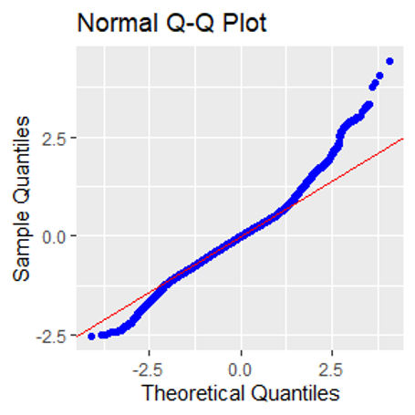
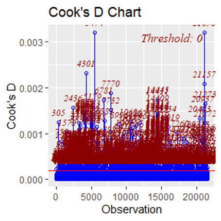
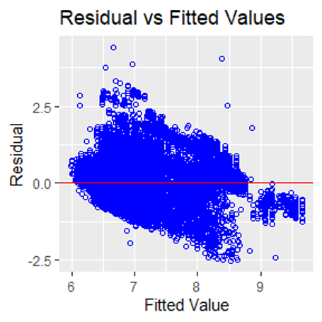
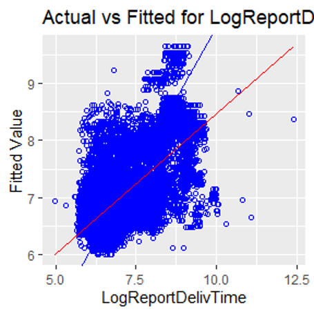
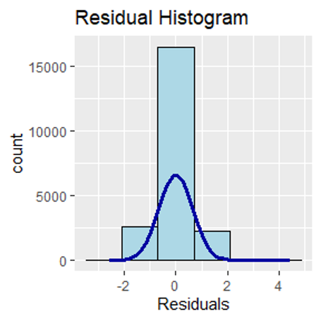
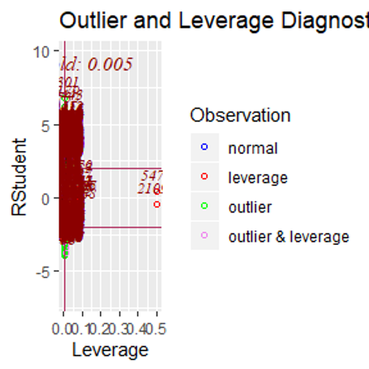
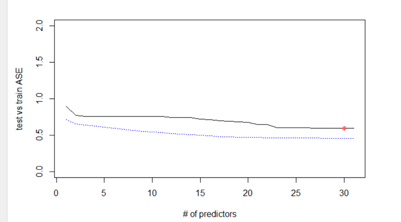

```{r setup, include=FALSE}
knitr::opts_chunk$set(echo = TRUE)
library(tidyverse)
library(data.table) #for %like% function
library(xml2)
library(lubridate)
library(tictoc)
library(kableExtra)
library(gridExtra)
library(olsrr) #residual plot analysis
library(GGally)
library(leaps)
library(glmnet)
library(caret)
library(car)
library(limma)
library(lsmeans)
library(magick)
#options(kableExtra.auto_format = FALSE)
# import report data:
load("./data/reports.RData")


# import helper functions:
source("./R/helperFunctions.R")

# wordStyleRef style changes:
## Set margins to .5"
## Heading 1 creates page break before line
## Heading 2 remove space before
## Heading 5 centers text (#####) 

```

##### 


# Introduction
Gilsbar offers a comprehensive reporting package to both its internal employees and external clients.  As our user base has grown over the last several years, we have seen an increased demand for reports and consequent load on report servers.  Report run times vary significantly, sometimes reports are returned in minutes, and in the worst case: hours.  In order to mitigate server load and improve report response time, we would like to better understand factors affecting delivery time, as well as to be able to provide our users an estimated delivery time of reports.  We would like to answer the following questions about our data:

1. What is the expected average delivery time of a new report?
2. What are the best & worst times of day, week, or month to run a report?
3. Is there a difference in performance between report servers?
4. What are the biggest impacts on performance of reports?

## Data Description
Gilsbar has provided report data spanning a 12 month period from January 2019 through January 2020. The available parameter list is very large, having over 500 parameters used in the past year.  In order to narrow the scope of the project, we focused on completed reports only, and determined the parameters show below would be most useful in predicting report run time. A description of other, non-utilized fields is available below in the appendix. Also listed there is a crosswalk provided which groups like-type reports into 11 categories. 

## Approach Methodology
We'd like to tackle these questions using two separate models for interpretation.  For our first objective, we use Multiple Linear Regression techniques to predict run-time using several of the report metrics and features.  As our second objective, we will utilize two-way ANOVA techniques to compare ReportDeliveryTime vs Server, Report Category, and Report Format.

# Exploratory Data Analysis
Our EDA analysis revealed that there are several categorical variables that don’t show an apparent linear relationship with ReportDeliveryTime.  Also, we found that our response variable, ReportDeliveryTime, is heavily right skewed and likely needs a log transformation in order to continue analysis.

Given some additional knowledge of the data-set, we learned that only three production servers are useful for prediction (SQLODR2, SQLODR3 and SQLODR6) and that the ReportID (Specific Report) may be related to ReportBuildTime.  To explore this, we converted the ReportID to factors and conducted simple linear regression, giving us an R^2 of 0.79 which is very good, however the ReportID has over 1500 factor levels which make the explanation difficult when introducing additional features, so we continued to explore other features and temporarily ignore ReportID.

Our EDA resulted in the following additional observations:  

* Submission times are most often 6am, with 9am and 6pm as secondary peak times.
* The first day of Month is peak report day
* Scheduled frequencies occur more often by Weekly, One-time, Monthly respectively.
* Reinsurance reports grossly exceed delivery times of all other reports, PL reports deliver fastest.
* Extract reports take the longest for servers to build, with miscellaneous building quickest.
* Finance/Billing and Eligibility reports outnumber others, and PL reports are run the least.(Note: PL Category is newest, so does not contain a full year worth of data).
* Most reports utilize Delivery Method: Web. 
* Production reports far outnumber test reports.
* 3 Servers processed most reports are SQLODR2, SQLODR3, SQLODR6.
* SQLODR2, SQLODR3, and SQLODR6 are all marked as production, while the others are marked as test.
* Popular Report formats are CSV/PDF followed by TXT/EXCEL.
* Reports are generated more on WeekDays with most occurring on Monday/Tuesday.
* Priorities only have 0.1, 2, 3, and 10, with 10 as the majority.
* SQLODR3 processes less reports than SQLODR2 or SQLODR6, and also appears to have a longer mean build time (i.e. worse performance) than the other two production servers.

```{r EDA plots, fig.width=7.25, fig.height=4.5, echo=FALSE, cache=TRUE}
# Plot Categorical Variables in character or factor

# Count By Server
e.server <- reports %>% group_by(Server) %>% summarise(Count=n()) %>% ggplot(aes(x=Server, y=Count)) + geom_bar(stat="identity", fill="orange", color="grey40") + labs(title="Reports by Server", x="Server",y="Count") + geom_text(aes(x=Server, y=0.01, label= Count), vjust=-2, size=3, colour="black", fontface="bold",angle=360)

# Count By SchedFreq
e.freq <- reports %>% group_by(SchedFreq) %>% summarise(Count=n()) %>% ggplot(aes(x=SchedFreq, y=Count)) + geom_bar(stat="identity", fill="orange", color="grey40") + labs(title="Reports by Schedule Frequency", x="Schedule Frequency",y="Count") + geom_text(aes(x=SchedFreq, y=0.01, label= Count), vjust=-2, size=3, colour="black", fontface="bold",angle=360)

# Count By RptFrmt
e.format <- reports %>% group_by(RptFrmt) %>% summarise(Count=n()) %>% ggplot(aes(x=RptFrmt, y=Count)) + geom_bar(stat="identity", fill="orange", color="grey40") + labs(title="Reports by Report Format", x="Report Format",y="Count") + geom_text(aes(x=RptFrmt, y=0.01, label= Count), vjust=-2, size=3, colour="black", fontface="bold",angle=360)

# Count By DelivMthd
e.delivery <- reports %>% group_by(DelivMthd) %>% summarise(Count=n()) %>% ggplot(aes(x=DelivMthd, y=Count)) + geom_bar(stat="identity", fill="orange", color="grey40") + labs(title="Reports by Delivery Method", x="Delivery Method",y="Count") + geom_text(aes(x=DelivMthd, y=0.01, label= Count), vjust=-2, size=3, colour="black", fontface="bold",angle=360)

# Count By Priority
e.priority <- reports %>% group_by(Priority) %>% summarise(Count=n()) %>% ggplot(aes(x=Priority, y=Count)) + geom_bar(stat="identity", fill="orange", color="grey40") + labs(title="Reports by Priority", x="Priority",y="Count") + geom_text(aes(x=Priority, y=0.01, label= Count), vjust=-2, size=3, colour="black", fontface="bold",angle=360)

# Count By DayOfWeek
e.weekday <- reports %>% group_by(DayOfWeek) %>% summarise(Count=n()) %>% ggplot(aes(x=DayOfWeek, y=Count)) + geom_bar(stat="identity", fill="orange", color="grey40") + labs(title="Reports by Day Of Week", x="DayOfWeek",y="Count") + geom_text(aes(x=DayOfWeek, y=0.01, label= Count), vjust=-2, size=3, colour="black", fontface="bold",angle=360) 

# Count By HourOfDay
e.hour <- reports %>% group_by(HourOfDay) %>% summarise(Count=n()) %>% ggplot(aes(x=fct_rev(HourOfDay), y=Count)) + geom_bar(stat="identity", fill="orange", color="grey40") + labs(title="Reports by Hour Of Day", x="HourOfDay",y="Count") + geom_text(aes(x=HourOfDay, y=0.01, label= Count), vjust=0.5, hjust=-.25, size=3, colour="black", fontface="bold",angle=360) + coord_flip()

# Count By DayOfMonth
e.month <- reports %>% group_by(DayOfMonth) %>% summarise(Count=n()) %>% ggplot(aes(x=fct_rev(DayOfMonth), y=Count)) + geom_bar(stat="identity", fill="orange", color="grey40") + labs(title="Reports by Day Of Month", x="DayOfMonth",y="Count") + geom_text(aes(x=DayOfMonth, y=0.01, label= Count), vjust=0.5, hjust=-.25, size=3, colour="black", fontface="bold",angle=360) + coord_flip()

# Count By ReportCategory
e.categorySum <- reports %>% group_by(ReportCategory) %>% summarise(Count=n()) %>% ggplot(aes(x=fct_rev(ReportCategory), y=Count)) + geom_bar(stat="identity", fill="orange", color="grey40") + labs(title="Sum of Reports By Category", x="Report Category",y="Reports") + geom_text(aes(x=ReportCategory, y=0.01, label= Count), vjust=0.5, hjust=-.25, size=3, colour="black", fontface="bold",angle=360) + coord_flip()

# Avg Delivery time by ReportCategory 
e.categoryDelivery <- reports %>% group_by(ReportCategory) %>% summarise(MeanDelivery=round(mean(ReportDeliveryTime),0)) %>% ggplot(aes(x=fct_rev(ReportCategory), y=MeanDelivery)) + geom_bar(stat="identity", fill="orange", color="grey40") + labs(title="Mean Delivery Time By Category", x="Report Category",y="Seconds") + geom_text(aes(x=ReportCategory, y=0.01, label= MeanDelivery), vjust=0.5, hjust=-.25, size=3, colour="black", fontface="bold",angle=360) + coord_flip()

# Avg Build time by ReportCategory 
e.categoryBuild <- reports %>% group_by(ReportCategory) %>% summarise(AvgTime=round(mean(ReportBuildTime),0)) %>% ggplot(aes(x=fct_rev(ReportCategory), y=AvgTime)) + geom_bar(stat="identity", fill="orange", color="grey40") + labs(title="Mean Build Time By Category", x="Report Category",y="Seconds") + geom_text(aes(x=ReportCategory, y=0.01, label= AvgTime), vjust=0.5, hjust=-.25, size=3, colour="black", fontface="bold",angle=360) + coord_flip()

## Count By ReportDeliveryTime
reports$ReportDeliveryTime = as.numeric(reports$ReportDeliveryTime)
e.deliveryHist <- ggplot(data=reports[!is.na(reports$ReportDeliveryTime),], aes(x=ReportDeliveryTime)) +
        geom_histogram(fill="orange", binwidth = 1000) + labs(title="Report Delivery Time", x="Report Delivery Time")

## Count By ReportDeliveryTime - log
reports$ReportDeliveryTime = as.numeric(reports$ReportDeliveryTime)
e.logDeliveryHist <- ggplot(data=reports[!is.na(reports$ReportDeliveryTime),], aes(x=log(ReportDeliveryTime))) +
        geom_histogram(fill="orange") + labs(title="Log Report Delivery Time", x="x=log(Report Delivery Time)")


grid.arrange(e.freq, e.priority, e.format, e.delivery,  ncol=2, nrow=2)
grid.arrange(e.server,e.weekday,  ncol=1, nrow=2)
grid.arrange(e.deliveryHist,e.logDeliveryHist,  ncol=1, nrow=2)


# Buildtime by server
reports %>% ggplot(aes(x=log(ReportBuildTime), fill=Server)) + geom_density(alpha = 0.7) + labs(title="Report Build time colored by Server")   


```


```{r EDA plots2, fig.width=7.25, fig.height=7.25, cache=TRUE, echo=FALSE}
grid.arrange(e.categorySum, e.categoryDelivery, e.categoryBuild, ncol=1, nrow=3)

grid.arrange(e.hour,e.month,  ncol=2, nrow=1)
```


```{r EDA Regression options, include=FALSE, cache=TRUE}

# Basic fit: ~ 33% r^2 and 6.65 MSE
#fit <- lm(log(ReportBuildTime)~ReportCategory + GroupCount + GroupCount*ReportCategory, data=reports)

# Better fit:
#fit <- lm(log(ReportBuildTime)~Server+Priority+GroupCount+ReportCategory+DayOfWeek+DayOfMonth+AgentCount+RptFrmt+DelivMthd+HourOfDay, data=reports)

# Better fit with interactions: (takes quite a few minutes) ~41% r^2 and 5.98s MSE
#fit <- lm(log(ReportBuildTime)~ReportCategory + HourOfDay + GroupCount + DayOfMonth +  HourOfDay*ReportCategory + GroupCount*ReportCategory + HourOfDay*DayOfMonth + GroupCount*DayOfMonth, data=reports)

# ReportId fit: (takes a few minutes)
fit <- lm(log(ReportBuildTime)~as.factor(ReportId), data=reports) # ~79% r^2 and 2.83s MSE
#fit2 <- lm(log(ReportDeliveryTime)~as.factor(ReportId), data=reports) # ~49% r^2 and 4.5s MSE


```

```{r EDA Regression Fit Diagnostics, cache=TRUE, include=FALSE}

########### Report Build Time Section ########### 
summary(fit)

# Split data into test/train (using 90% to increase plotting speed)
trainIndices = sample(1:dim(reports)[1],round(.90 * dim(reports)[1]))
train = reports[trainIndices,]
test = reports[-trainIndices,]

# Make predictions & calculate MSE
p <- predict(fit, interval="predict",newdata = test)
RMSE <- sqrt(mean((p[,1] - log(test$ReportBuildTime))^2))
# Back transform the RMSE:
exp(RMSE)

# Plot the predictions vs test data:
preds <- data.frame(cbind(log(test$ReportBuildTime), p[,1]))

# raw log data:
plot(log(test$ReportBuildTime), p[,1])

# pretty raw log data:
ggplot(preds, aes(log(test$ReportBuildTime), p[,1])) + geom_point() + labs (y="Predicted Log Seconds", x="Actual Log Seconds")

# back transformed data: (note the outliers)
ggplot(preds, aes(test$ReportBuildTime, exp(p[,1]))) + geom_point() + labs (y="Predicted Seconds", x="Actual Seconds")

# Zoom in to see same scale:
ggplot(preds, aes(test$ReportBuildTime, exp(p[,1]))) + geom_point() + labs (y="Predicted Seconds", x="Actual Seconds") + xlim(0, 1500) + ylim(0, 1500) 

########### Report Delivery Time Section ########### 

#summary(fit2)

# Make predictions & calculate MSE
#p2 <- predict(fit2, interval="predict",newdata = test)
#RMSE <- sqrt(mean((p2[,1] - log(test$ReportDeliveryTime))^2))
# Back transform the RMSE:
#exp(RMSE)

# Plot the predictions vs test data:
#preds2 <- data.frame(cbind(log(test$ReportDeliveryTime), p[,1]))

# raw log data:
#plot(log(test$ReportDeliveryTime), p2[,1])

# pretty raw log data:
#ggplot(preds2, aes(log(test$ReportDeliveryTime), p2[,1])) + geom_point() + labs (y="Predicted Log Seconds", x="Actual Log Seconds")

# back transformed data: (note the outliers)
#ggplot(preds2, aes(test$ReportDeliveryTime, exp(p2[,1]))) + geom_point() + labs (y="Predicted Seconds", x="Actual Seconds")

# Zoom in to see same scale:
#ggplot(preds2, aes(test$ReportDeliveryTime, exp(p2[,1]))) + geom_point() + labs (y="Predicted Seconds", x="Actual Seconds") + xlim(0, 20000) + ylim(0, 20000) 


```

# Objective 1
__Using known parameters of a desired report, can we predict how long it will take to run a particular type of report?__ 

We have found it best to use all parameters made available to us within the transformed 'reports' data-set to fit the response variable “ReportDeliveryTime.”  Within the report, intuition tells us a few key parameters contribute strongly to the delivery time.  For example: ReportBuildTime, QueueTime, LagTime and ReportBytes, cannot be used because they are all unknown before report completion. 

## Simple Linear Regression Model
Looking at ReportBuildTime vs ReportId gives us the best $R^{2}$ at approximately .79 and a 2.83s RMSE.  ReportDeliveryTime vs ReportId gives us an acceptable $R^{2}$ of about .49 and a 4.5s RMSE.  This performance is acceptable, but becomes very difficult to explain when adding additional features due to the large number of reports (over 1,000).  Thus, we will attempt to answer a broader question: given a report group how long should I expect to wait?

## Multiple Linear Regression subset

Because the amount of data is very large and we didn’t find a dependency of ReportID with ReportDeliveryTime, we chose a single type of report “ReportID=93”, which is roughly 1/10 of the overall data-set as a representative subset and used it for the remaining analysis.

With this subset, we filtered out a few more parameters and left 10 parameters: Server, ReportCategory, SchedFreq, HourOfDay, DayOfMonth, ReportCategory,Server, AgentCount, GroupCount,DelivMethod. 

First we did a fit with all parameters and get a resulted $R^{2}$ of 0.54, which is not too bad, but is quite difficult to explain.

Ultimately after using several feature selection methodologies, we discovered that using all 30 features nets an $R^{2}$ of 0.54, while using just 5 of the most statistically significant features results in an $R^{2}$ of 0.52.  

```{r Obj1 Setup, cache=TRUE, include=FALSE}
reports_serv_samp <- reports %>% filter(ReportId == "93") 

reports_serv_new <- within(reports_serv_samp,
rm(ReportId,Priority,RptFrmt,QueuedDateTime,RenderStartDateTime,ReportStartDateTime,ReportEndDateTime, RenderEndDateTime,GroupCustom,CurrencyCode,groupSF,groupFI,ReportBuildTime,QueueTime,LagTime,Agents,TestProdIndicator,ReportBytes,HourBinned,TimeBlock3h,TimeBlock4h,DateFrom,DateThru,queued,NumDays))


#pairs(reports_serv_new[,-c(2,9)])

all_model<-lm(ReportDeliveryTime~., data=reports_serv_new)
summary(all_model)$adj.r.squared

all_model_log<-lm(log(ReportDeliveryTime)~., data=reports_serv_new)
summary(all_model_log)$adj.r.squared

reports_serv_newlog <- reports_serv_new
reports_serv_newlog$LogReportDelivTime <- log(reports_serv_newlog$ReportDeliveryTime)
reports_serv_newlog <- na.omit(reports_serv_newlog)
reports_serv_newlog <- within(reports_serv_newlog, rm(ReportDeliveryTime))


set.seed(1234)
index<-sample(1:dim(reports_serv_newlog)[1],20000,replace=F)
train<-reports_serv_newlog[index,]
test<-reports_serv_newlog[-index,]

# 
log.fwdnv20=regsubsets(LogReportDelivTime~.,data=reports_serv_newlog,method="forward",nvmax=30)
log.stepnv20=regsubsets(LogReportDelivTime~.,data=reports_serv_newlog,method="seqrep",nvmax=30)
trainlog.fwdnv30=regsubsets(LogReportDelivTime~.,data=train,method="forward",nvmax=30)
trainlog.stepnv30=regsubsets(LogReportDelivTime~.,data=train,method="seqrep",nvmax=30)

```

### Checking Assumptions
Linear Regression analysis has basic assumptions of residual normality, linearity of features, constant variance (equal spread), and independence of observations.

The q-q plot below (and previous histogram) shows that the assumption of normality has much improved after log transforming our response variable.  We confirmed this to be correct by fitting the final model after log transformation. 

After transformation we observed the q-q plot to exhibit qualities indicating the data is more normal: ideally we want a mostly straight line following closely to the residual 0 line. 

* QQ Plot shows a slight departure from normality
* Cook's D shows no major leverage points (.003)
* There are a few outliers with leverage in the sample selection, but not as much in the full data
* Histogram shows normality with a bit of right skew
* Ideally we'd like to see a totally random cloud in the fitted vs residuals
* The outliers are impacting predictions fairly significantly as can be seen by the leverage chart

 


 


  


### Model Selection
#### Feature Selection: Forward  

```{r Obj1 Forward Selection, cache=TRUE, echo=FALSE, warning=FALSE, fig.height=3, fig.align='center'}


#summary(log.fwdnv20)
#summary(log.fwdnv20)$adjr2
#summary(log.fwdnv20)$rss
#summary(log.fwdnv20)$bic


par(mfrow=c(1,3))
bics<-summary(log.fwdnv20)$bic
plot(1:31,bics,type="l",ylab="BIC",xlab="# of predictors")
index<-which(bics==min(bics))
points(index,bics[index],col="red",pch=10)


adjr2<-summary(log.fwdnv20)$adjr2
plot(1:31,adjr2,type="l",ylab="Adjusted R-squared",xlab="# of predictors")
index<-which(adjr2==max(adjr2))
points(index,adjr2[index],col="red",pch=10)

rss<-summary(log.fwdnv20)$rss
plot(1:31,rss,type="l",ylab="train RSS",xlab="# of predictors")
index<-which(rss==min(rss))
points(index,rss[index],col="red",pch=10)

# Output coefficients
as_image(kable_styling(kable(coef(log.fwdnv20,10))), file = './img/fwd.png')

testASE<-c()
#note my index is to 20 since that what I set it in regsubsets
for (i in 1:31){
  predictions_fwd<-predict.regsubsets(object=trainlog.fwdnv30,newdata=test,id=i) 
  testASE[i]<-mean((test$LogReportDelivTime-predictions_fwd)^2)
}

par(mfrow=c(1,1))
plot(1:31,testASE,type="l",xlab="# of predictors",ylab="test vs train ASE",ylim=c(0,2))
index<-which(testASE==min(testASE))
points(index,testASE[index],col="red",pch=10)
rss<-summary(trainlog.stepnv30)$rss
lines(1:31,rss/10000,lty=3,col="blue")  #Dividing by 100 since ASE=RSS/sample size

RMSE_org_Fwd <- RMSE(exp(predictions_fwd), exp(test$LogReportDelivTime))


```

#### Feature Selection: Stepwise  

```{r Obj1 Seq Rep Selection, cache=TRUE, echo=FALSE, warning=FALSE, fig.height=3, fig.align='center'}
#summary(log.stepnv20)
#summary(log.stepnv20)$adjr2
#summary(log.stepnv20)$rss
#summary(log.stepnv20)$bic

par(mfrow=c(1,3))
bics<-summary(log.stepnv20)$bic
plot(1:31,bics,type="l",ylab="BIC",xlab="# of predictors")
index<-which(bics==min(bics))
points(index,bics[index],col="red",pch=10)

adjr2<-summary(log.stepnv20)$adjr2
plot(1:31,adjr2,type="l",ylab="Adjusted R-squared",xlab="# of predictors")
index<-which(adjr2==max(adjr2))
points(index,adjr2[index],col="red",pch=10)

rss<-summary(log.stepnv20)$rss
plot(1:31,rss,type="l",ylab="train RSS",xlab="# of predictors")
index<-which(rss==min(rss))
points(index,rss[index],col="red",pch=10)

# Output coefficients
as_image(kable_styling(kable(coef(log.stepnv20,10))), file = './img/step.png', height = 4)


testASE<-c()
#note my index is to 20 since that what I set it in regsubsets
for (i in 1:31){
  predictions_step<-predict.regsubsets(object=trainlog.stepnv30,newdata=test,id=i) 
  testASE[i]<-mean((test$LogReportDelivTime-predictions_step)^2)
}
par(mfrow=c(1,1))
plot(1:31,testASE,type="l",xlab="# of predictors",ylab="test vs train ASE",ylim=c(0,2))
index<-which(testASE==min(testASE))
points(index,testASE[index],col="red",pch=10)
rss<-summary(trainlog.stepnv30)$rss
lines(1:31,rss/10000,lty=3,col="blue")  #Dividing by 100 since ASE=RSS/sample size

RMSE_org_Step <- RMSE(exp(predictions_step), exp(test$LogReportDelivTime))

```

#### Final Model Selection:

After the log transformation and re-fitting we get an $R^{2}$ of 0.54! This is good but because we have several features with numerous factor levels, we decided to do a round of feature selection using forward, backward and other criteria.

Using forward model selection and nvmax=30, we recognized that the BIC, adjusted $R^{2}$ and RSS shown in plot all show a “plateau” after roughly 25-30 parameters, indicating that we can get best fit and avoid further overfitting. 

We also tried a stepwise selection process and found that the BIC, adjusted $R^{2}$ and RSS showed a similar trend to forward selection. There are 4 variables that appear to be significant: SchedFreq, HourOfDay, DayOfMonth and ReportCategory. The lowest BIC/RSS is similar to forward selection.

By checking the coefficients we identified SchedFreqOneTime and SchedFreqWeek to be statistically significant, so we included SchedFreq in the final model. Some variables related to HourOfDay are siginificant, to include them all we include HourOfDay as a variable in the final model. The final selection composes of 5 variables and the model is below:

$$log(ReportDeliveryTime) = SchedFreq + HourOfDay + DayOfMonth + ReportCategory + Server$$

When we initially build our intuitive model we did not split our dataset into train and test portions. We further conduct LASSO, Ridge and Elastic net for model fitting and there’s no fair way to compare the model of all above methods without a train/test experiment.
So we perform a roughly 70-30 split on our original dataset to create a train and a test set, then use our train set to fit our optimized linear model and create a prediction vector from our test dataset.
Then we can calculate our MSE of this model and compare it to those of forward, stepwise, LASSO, Ridge and Elastic net, we get the result below.

__A comparison of Feature Selection methods and their RMSE (lower is better):__

|Method |	RMSE|
|---|---|
|Lasso|	1967.324|
|Ridge	|1908.051|
|Elastic Net|	1905.987|
|Forward|	2099.483|
|Stepwise	|2099.574|
|LM (5 variables)	|1963.45|


From the table above we can see that Lasso, Ridge and Elastic Net all give us a RMSE very close to each other, and slightly smaller than the multi-linear model. And the forward and stepwise model give us a higher-than-other RMSE. Because the Lasso models used all the variables we are at a risk of overfitting. 
Below shows a test versus train ASE plot and we can see that the test and train error are very close with a suggestion of including ~30 variables (really 5 category variables). 

Below is a graphical representation of the results of the forward model:

#####   


### Interpretation
Interpretting the outcome of the model requires us to check the coefficients in the table below and provide an explanation. In each categorical variable we can see one level has been chosen to use as the reference. We can check and find all the variables which listed below are with statistically significant p-value.

* Intercept is the mean estimate for the report delivery time keeping other variables constant. 
* SchedFreqOneTime coefficient can be interpreted as the mean delivery time change from the reference of SchedFreqMonth. 
* HourOfDay07 can be interpreted as the mean delivery time change from the reference of HourOfDay06. 
* DayofMonth02 can be interpreted as the mean delivery time change from the reference of DayofMonth01.
* ReportCategoryExtract can be interpreted as the mean delivery time change from the reference of ReportCategoryClaims. 
* ServerSQLODR3 can be interpreted as the mean delivery time change from the reference of ServerSQLODR2.    
The logged variables need to be transformed back from their log in order to be properly interpreted in the context of other variables. Because this is a liner-log model, when interpreting the coefficient of ReportDelivTime, a one unit change in the ReportDelivTime would result in an exp(Beta) change in the mean of y.

The confidence intervals for the parameter estimates are in the table below. The confidence intervals show that all the listed variables don’t contain zero at the 95% level. This indicates that we can reject the null hypothesis and say that these estimates are significantly different from zero.


```{r Obj1 Final Model Selection, cache=TRUE, echo=FALSE, warning=FALSE, fig.height=9}
final.model<-lm(LogReportDelivTime~SchedFreq + HourOfDay + DayOfMonth + ReportCategory + Server,data=reports_serv_newlog)
#summary(final.model)$adj.r.squared

# Output final coefficients

finalDF <- cbind(data.frame(coef(final.model)), confint(final.model))

as_image(kable_styling(kable(finalDF)), file = './img/final.png', height=9, width = 4)

final.model.train<-lm(LogReportDelivTime~SchedFreq + HourOfDay + DayOfMonth + ReportCategory + Server,data=train)
predictions_lm <- final.model.train %>% predict(test) %>% as.vector()

RMSE_org_LM <- RMSE(exp(predictions_lm), exp(test$LogReportDelivTime))
```


## Conclusion
In conclusion, the mulit-linear model with 5 predictors leveraging a logged response gave the best MSE with avoidance of over-fitting. We used a train and test split to validate the MSE across many methods and reached this conclusion.  We know that the day of the month, the hour of the day, and the report category cause significant changes to estimated report delivery, with several unknown factors possibly related the number of queued reports contributing to large outliers in delivery time.

We also suspect that multiple linear regression isn't the best model for predicting run time given this extremely variable data-set.  Several high leverage outliers keep the MLR model from tightening predictions to desirable tolerances.  Report delivery time varies from milliseconds to several days, which may be the result of a failed report which was restarted, or a large number of queued reports (such as those beginning at 6am on the first.)  Having indicators for restarted reports, or the count of reports in the queue at the time the report starts would be useful in predicting run-time.


# Objective 2
__Our question of interest from Gilsbar is which server, and what time of day yields the best performance to schedule new reports? __

We ran a two-way ANOVA on the data to satisfy the second objective. The business requirements drove the selection of the explanatory variables. The business wants to know what time of day and on which server new reports should be added based upon current report run times as expressed by the ReportDeliveryTime response variable.

### Explanatory and Response variable creation	

The two explanatory variables require some explanation. The “server” variable required us to remove the data associated with testing and development servers. The testing and development report run times have very different characteristics than production data. Thus, all data associated with servers “SQLODR1” and “SQLODR5” were removed.

“HourBinned” variable indicates the time of day the report ran. Several things should be noted about it. A maintenance window exists every night between the hours of midnight and six AM. Only a few reports run during this maintenance window. Likewise, relatively few reports run during the late evening hours between eight PM and midnight. We binned these two time periods separately. The remaining time during the days was binned in two-hour blocks. The summary tables below give counts and means of the various bins.

```{r FilterAndBin, cache=TRUE, include=FALSE}

servestats <-aggregate(ReportDeliveryTime~Server,data=reports,mysummary)
servestats.df <- data.frame(servestats[,1:1],servestats[,-(1)])
servestats.df
```

The table above shows that server “SQLODR3” runs fewer reports than the other two servers and has differences in mean report run time and standard deviation.

### Server Performance Analysis

```{r continuesummary, cache=FALSE, echo=FALSE}
hourstats <-aggregate(ReportDeliveryTime~HourBinned,data=reports,mysummary)
hourstats.df <- data.frame(hourstats[,1:1],hourstats[,-(1)])
#pander::pander(hourstats.df)
hourstats.df

sumstats<-aggregate(ReportDeliveryTime~HourBinned:Server,data=reports,mysummary)
sumstats<-cbind(sumstats[,1:2],sumstats[,-(1:2)])

```

Looking at the data above for the BinnedHour variable the late evening hours and the overnight maintenance window bins display very different standard deviations than the rest of the bins. Also, of note the sample count size differs for those two bins. Finally reports should not be added to the overnight bin that includes the maintenance window.

```{r numReportPlot, cache=TRUE, echo=FALSE}


ggplot(mapping=aes(x=HourBinned,y=N,color=Server,group=Server),data=sumstats)+
  geom_line()+
  geom_point()+ylab("Number of reports run") + xlab("Binned time report ran")+
  ggtitle("Number of reports ran by time of day per server")


```

The graph shows that each server tracks the others in terms of reports run at a particular hour. A simple interpretation of the results benefits the business directly. The first analysis of the data included an unlogged response variable. 

The bins for overnight and late evening (“0005”,”2023”) have been excluded from the remainder of analysis.

```{r UnloggedResponseResidual, cache=TRUE, echo=FALSE}

#Remove early morning late evening

reports.fltr <- reports %>% filter(!HourBinned == "0005" & !HourBinned == "2023")

model.fit.HrBnSrv <- aov(ReportDeliveryTime~Server+HourBinned+HourBinned:Server, data = reports.fltr)
anova.disp <- Anova(model.fit.HrBnSrv,type=3,singular.ok=FALSE)

anova.disp[4]
```

The type 3 ANOVA table indicates that both terms as well as the interaction term are statistically significant with very low p-values.

```{r ANOVAIIINoLog, cache=TRUE, echo=FALSE}
myfits<-data.frame(fitted.values=model.fit.HrBnSrv$fitted.values,residuals=model.fit.HrBnSrv$residuals)

#Residual vs Fitted

plot1<-ggplot(myfits,aes(x=fitted.values,y=residuals))+ylab("Residuals")+
  xlab("Predicted")+geom_point()+ggtitle("Log ReportDeliveryTime Residuals")

#QQ plot of residuals  #Note the diagonal abline is only good for qqplots of normal data.
plot2<-ggplot(myfits,aes(sample=residuals))+
  stat_qq()+geom_abline(intercept=mean(myfits$residuals), slope = sd(myfits$residuals))+
  ggtitle("Log ReportDeliveryTime Q-Q plot")

#Histogram of residuals
plot3<-ggplot(myfits, aes(x=residuals)) + 
  geom_histogram(aes(y=..density..),binwidth=1,color="black", fill="gray")+
  geom_density(alpha=.1, fill="red")+
  ggtitle("Log ReportDeliveryTime Histogram")

plot1
plot2
# plot3 Don't run this one takes too long and we are not going to use it anyway
```

The residual plot appears to demonstrate a cone shape with residuals beneath 2000 being noticeably more spread out than those above 3000. The Q-Q plot displays dramatic differences from normality. A log transform of the response variable is necessary.

```{r loggedResponsesummary, cache=TRUE, echo=FALSE}
reports.fltr$ReportDeliveryTimeLog <- log(reports.fltr$ReportDeliveryTime)

model.fit.HrBnSrvlg <- aov(ReportDeliveryTimeLog~Server+HourBinned+HourBinned:Server, data = reports.fltr)
anova.fltr.disp <- Anova(model.fit.HrBnSrvlg,type=3,singular.ok=FALSE)

anova.fltr.disp[4]
```

The type III ANOVA table again shows that both the interaction term as well as the individual terms are significant.

```{r Summaryloged, cache=TRUE, echo=FALSE}

servestats.fltr <-aggregate(ReportDeliveryTimeLog~Server,data=reports.fltr,mysummary)
servestats.fltr.df <- data.frame(servestats.fltr[,1:1],servestats.fltr[,-(1)])
servestats.fltr.df
```

The mean and standard deviation of the logged ReportDeliveryTime track extremely close now with respect to the server variable.

```{r logbinsummary, cache=TRUE, echo=FALSE}
hourstats.fltr <-aggregate(ReportDeliveryTimeLog~HourBinned,data=reports.fltr,mysummary)
hourstats.fltr.df <- data.frame(hourstats.fltr[,1:1],hourstats.fltr[,-(1)])
hourstats.fltr.df

sumstats.log.fltr<-aggregate(ReportDeliveryTimeLog~HourBinned:Server,data=reports.fltr,mysummary)
sumstats.log.fltr<-cbind(sumstats.log.fltr[,1:2],sumstats.log.fltr[,-(1:2)])
#sumstats.log.fltr
```


The HourBinned variable does display some differences in standard deviation. This issue is examined below. Please note that the over night and late evening hours were dropped from the model.  An explanation for a penalty (4x multiplier on P-Value) we have applied to account for the variance in standard deviation may be found in the appendix section titled:  2-way ANOVA violation in SD.

The following graph shows that the mean log of the delivery time varies by the time of day and has a different standard deviation during times of high loads. 

```{r plotbySrvHour, cache=TRUE, echo=FALSE}

ggplot(mapping=aes(x=HourBinned,y=Mean,color=Server,group=Server),data=sumstats.log.fltr)+
  geom_line()+
  geom_point()+
  geom_errorbar(aes(ymin=Mean-SD,ymax=Mean+SD),width=.1)+
  ylab("Mean logged response of reports run") + xlab("Binned time report ran")+
  ggtitle("Mean logged delivery time of reports ran by time of day per server")

```

The following plots were created to further check for normality

```{r loggedResponseResidual, cache=TRUE, echo=FALSE}
myfits<-data.frame(fitted.values=model.fit.HrBnSrvlg$fitted.values,residuals=model.fit.HrBnSrvlg$residuals)

#Residual vs Fitted

plot1.fltr.log<-ggplot(myfits,aes(x=fitted.values,y=residuals))+ylab("Residuals")+
  xlab("Predicted")+geom_point()+ggtitle("Log ReportDeliveryTime Residuals Filtered")

#QQ plot of residuals  #Note the diagonal abline is only good for qqplots of normal data.
plot2.fltr.log<-ggplot(myfits,aes(sample=residuals))+
  stat_qq()+geom_abline(intercept=mean(myfits$residuals), slope = sd(myfits$residuals))+
  ggtitle("Log ReportDeliveryTime Q-Q plot Filtered")

#Histogram of residuals
plot3.fltr.log<-ggplot(myfits, aes(x=residuals)) + 
  geom_histogram(aes(y=..density..),binwidth=1,color="black", fill="gray")+
  geom_density(alpha=.1, fill="red")+
  ggtitle("Log ReportDeliveryTime Histogram Filtered")

plot1.fltr.log
plot2.fltr.log
plot3.fltr.log

```

Residuals, Q-Q plot, and the Histogram all support the assumption of normality.
Finally, a pairwise comparison based upon server and HourBinned was run. Remember to adjust p-value by a factor of four due to the unequal variance and sample sizes.


```{r ContrastsHours, cache=TRUE, echo=FALSE}
TukSrv <- TukeyHSD(model.fit.HrBnSrvlg,"Server",conf.level=.95)

TukHrB <- TukeyHSD(model.fit.HrBnSrvlg,"HourBinned",conf.level=.95)

TukSrvHrB <- TukeyHSD(model.fit.HrBnSrvlg,"Server:HourBinned",conf.level=.95)

TukSrv[1]
TukHrB[1]
```

Conclusion and discussion
	
The business asked that we determine on what server and at what time of day additional reports should run. 

Due to the residual and Q-Q plot of the untransformed data it was found to be necessary to perform a log transform of the response data. The data responded well to the transformation displaying all the characteristics of normalized data.
Using the table “Mean logged response of reports ran by time of day per server” above we can make the following recommendations.
•	The number of reports run on server “SQLODR03” is about 20 % less than the other two servers. However, at most it has only 18% faster mean report delivery time(95% CI[5.3% - 32%]) this is between server “SQLODR03” and “SQLODR6” for the 10 AM through noon time period
•	The time period 6 AM to 8 AM has the highest mean report delivery time, followed by 8 AM to 10 AM and 6 PM to 8 pm. Every effort should be made to not schedule new reports during these time frames.
•	The time period noon to 2 PM has the lowest mean report delivery time, thus if possible new reports should be added there. The relative loading of the servers is as follows. Server “SQLODR02” has a 48% greater mean report delivery time (95% CI[31%, 68%]) than server”SQLODR06” for that time frame. While server “SQLODR3” has a 27% greater mean report delivery time (95% CI[11% , 44%]) than server ”SQLODR06”. Server ”SQLODR06” is the lightest loaded server as measured by mean report delivery time during the noon to 2PM time frame.
•	The very late evening hours 8PM to midnight remain an option for scheduling reports. Care must be taken that any reports scheduled during that time do not run past midnight into the maintenance window.


# Appendix: Features

## Report Parameters
* Agents - Individual AgentIDs 
* CurrencyCode - Collection of different lines of business
* GroupCustom - Collection of different client types
* GroupFI - Fully Insured Client
* GroupSF - Self Funded Client
* ReportID - Uniquely identifies a report
* QueueID - Uniquely identifies a queue of one or more reports
* FormID - Uniquely identifies collection of report parameters 


## Report Metrics
* Priority - Controlled report parameter
* QueuedDateTime - When report entered queue
* RenderStartDateTime - When server began work on queued report(s) in queueID batch
* ReportStartDateTime - When server began work on individual report
* ReportEndDateTime - When server completed work on individual report
* RenderEndDateTime - When server completed work on queued report(s) in queueID batch
* ReportBytes - Size in bytes of completed report
* RptFormat - Format of the report delivered
* SchedFreq - Scheduled Report Frequency
* Server - Server on which the report was built


## Engineered Features
* AgentCount - Number of agents selected
* DayOfMonth - Day of the month report ran
* DayOfWeek - Day of the week report ran
* GroupCount - Number of clients selected
* HourOfDay - Hour of the day report ran
* LagTime - Time report waited for batch to finish (RenderEndDateTime less ReportEndDateTime)
* QueueTime - Time report entered queue (RenderStartDateTime less QueuedDateTime)
* ReportBuildTime - Time spent to build the report (ReportEndDateTime less ReportStartDateTime)
* ReportDeliveryTime - Time user spent waiting for report (RenderEndDateTime less QueuedDateTime)


# Appendix: Report Categories
## Report Category crosswalk: 
|Category|Groups|
|---|---|
|Eligibility|"Eligibility","Accumulator","EventHistory","COBRA","RedCard","ComPsych"|  
|Miscellaneous|"Miscellaneous"|
|Reinsurance|"Reinsurance","Aggregate Report"|
|Professional Liability|"PL"|
|Actuarial|"Actuarial","ISBReports","Renewal", *except when rptCategoryDesc = 'Renewal' and reportGroup = 'CommissionsTFB' use 'Commissions'*|
|Finance Commission|"Commissions","CRMOnlineFinance","CommCnt","CommCompare"|
|Claims|"ClaimsAudit","CMSRepting","Repository","GilsbarPPO","Claims"|
|Medical Management|"Wellness Repository","MedCom","TVC","MedInsight"|
|Metrics|"iTrac","TMS","Customer Service","ODR Admin","PortalStats","AutoAdjudication","Genelco","Supervisor"|
|Extract|"DataExtracts","Large Claims Reports"|
|Finance Billing|"Billing", "Coverage","Refunds","Credit Card Process","Deposit","CheckRecon","Check Register","FinancePremium", "Premium"|

# Appendix: Data Preparation
## ETL of original data

```{r Appendix.ETL pipeline, eval=FALSE}

tic('total run-time')

# Note I have relabeled this originalReports
load("./data/originalReports.RData")
load("./data/customGroups.RData")
load("./data/currencyCode.RData")

# Remove imported reports & dev servers:
reports <- reports %>% filter(Server %in% c('SQLODR2','SQLODR3','SQLODR6'))

# Drop report with bad data:
reports <- reports %>% filter(!is.na(RunTimeSEC))

tic('clean XML')

# Clean up the XML:
reports$XMLResponseStringClean <- str_replace(reports$XMLResponseString, '>>', '>')
reports$XMLResponseStringClean <- str_replace(reports$XMLResponseStringClean, '&', '-and-')
reports$XMLResponseStringClean <- str_replace(reports$XMLResponseStringClean, 'Transaction Entry Date Thru', 'TransactionEntryDateThru')
reports$XMLResponseStringClean <- str_replace(reports$XMLResponseStringClean,'(<AgentCode>.*</AgentCode>)<ODRParameters>','<NewDataSet><ODRParameters>\\1')
toc()

tic('XML to Cols')
# Parse XML values into Columns: (this might take a minute or two each)
reports$GroupCustom <- sapply(reports$XMLResponseStringClean, function(x) 
  ifelse(x %like% '<GroupCustom>', xml_find_all(read_xml(x), './/GroupCustom') %>% xml_text(), NA))
reports$CurrencyCode <- sapply(reports$XMLResponseStringClean, function(x) 
  ifelse(x %like% '<CurrencyCode>', xml_find_all(read_xml(x), './/CurrencyCode') %>% xml_text() %>% toupper(), NA))
reports$groupFI <- sapply(reports$XMLResponseStringClean, function(x) 
  ifelse(x %like% '<GroupFI>', xml_find_all(read_xml(x), './/GroupFI') %>% xml_text(), NA))
reports$groupSF <- sapply(reports$XMLResponseStringClean, function(x) 
  ifelse(x %like% '<GroupSF>', xml_find_all(read_xml(x), './/GroupSF') %>% xml_text(), NA))
reports$Agents <- sapply(reports$XMLResponseStringClean, function(x) 
  ifelse(x %like% '<AgentCode>', xml_find_all(read_xml(x), './/AgentCode') %>% xml_text(), NA))
toc()

# Capture number of days:
tic("Dates")
reports$DateFrom <- sapply(reports$XMLResponseStringClean, function(x) 
  ifelse(x %like% 'DateFrom>\\d+'| x %like% 'DateRangeFrom', str_replace(x, '.*Date(RangeFrom|From)>(\\d+)</.*', '\\2'), NA))
reports$DateThru <- sapply(reports$XMLResponseStringClean, function(x) 
  ifelse(x %like% 'DateThru>\\d+'| x %like% 'DateRangeThru', str_replace(x, '.*Date(RangeThru|Thru)>(\\d+)</.*', '\\2'), NA))

reports$queued <- as_date(reports$QueuedDateTime)
reports$queued <- str_replace_all(reports$queued, "-", "")

reports$DateThru <- ifelse(is.na(reports$DateThru),NA,ifelse((as_date(reports$DateThru) > as_date('20251231') | reports$DateThru == "") & as_date(reports$DateFrom) != as_date(reports$DateThru), reports$queued, reports$DateThru))

reports$NumDays <- ifelse(is.na(reports$DateFrom) | is.na(reports$DateThru) , NA , difftime(as_date(reports$DateThru), as_date(reports$DateFrom) , units = "days"))
reports$NumDays <- ifelse(as_date(reports$DateFrom) == as_date(reports$DateThru), 1, reports$NumDays)
reports$NumDays <- abs(reports$NumDays)

reports$NumDays <- ifelse(reports$XMLResponseStringClean %like% '>(CURRENT|PRIOR)YEAR<', 365, reports$NumDays)
reports$NumDays <- ifelse(reports$XMLResponseStringClean %like% '>(CURRENT|PRIOR)QUARTER<', 91, reports$NumDays)
reports$NumDays <- ifelse(reports$XMLResponseStringClean %like% '>(CURRENT|PRIOR)MONTH<', 30, reports$NumDays)
reports$NumDays <- ifelse(reports$XMLResponseStringClean %like% '>(CURRENT|PRIOR)WEEK<', 7, reports$NumDays)
reports$NumDays <- ifelse(reports$XMLResponseStringClean %like% '>(CURRENT|PRIOR)DAY<', 1, reports$NumDays)
reports$NumDays <- ifelse(reports$XMLResponseStringClean %like% '>ROLLING3MONTHS<', 91, reports$NumDays)
reports$NumDays <- ifelse(reports$XMLResponseStringClean %like% '>ROLLING6MONTHS<', 182, reports$NumDays)
reports$NumDays <- ifelse(reports$XMLResponseStringClean %like% '>ROLLING12MONTHS<', 365, reports$NumDays)
reports$NumDays <- ifelse(reports$XMLResponseStringClean %like% '>ROLLING15MONTHS<', 456, reports$NumDays)
reports$NumDays <- ifelse(reports$XMLResponseStringClean %like% '>ROLLING24MONTHS<', 730, reports$NumDays)
toc()

# Count commas to determine number of Agents
reports$AgentCount <- ifelse(is.na(reports$Agents), 0, str_count(reports$Agents, ',')+1)


# Join GroupCount to GroupCustom:
reports <- left_join(reports, CustomGroups, by=c('GroupCustom' = 'CustomGroupCode'))


# Capture original GroupCount
reports$CustomGroupCount <- reports$GroupCount


# Build CurrencyCode counts: (this will take a few minutes)
tic("CC Function")
reports$CurrencyCodeGroups <- sapply(reports$CurrencyCode, function(x) ifelse(is.na(x), 0, getCCgroups(x)))
toc()

# Merge GroupCounts:
reports$GroupCount <- ifelse(!is.na(reports$groupFI), 1, reports$GroupCount)
reports$GroupCount <- ifelse(!is.na(reports$groupSF), 1, reports$GroupCount)
reports$GroupCount <- ifelse(reports$XMLResponseStringClean %like% '<ExtGroupNumber>', 1, reports$GroupCount)
reports$GroupCount <- ifelse(reports$XMLResponseStringClean %like% '>ALLGROUPS<', 8353, reports$GroupCount)
reports$GroupCount <- ifelse(is.na(reports$GroupCount), reports$CurrencyCodeGroups, reports$GroupCount)
reports$GroupCount <- ifelse(reports$CurrencyCodeGroups < reports$GroupCount & reports$CurrencyCodeGroups > 0, reports$CurrencyCodeGroups, reports$GroupCount)
reports$GroupCount <- ifelse(is.na(reports$GroupCount),8353,reports$GroupCount)
reports$GroupCount <- ifelse((reports$GroupCount == 0),8353,reports$GroupCount)

# Update report categories: Adam


reports$ReportCategory <- case_when(reports$RptCategoryDesc %in% 
                              c("Eligibility","Accumulator","EventHistory","COBRA",
                                "RedCard","ComPsych") ~ "Eligibility",
                            reports$RptCategoryDesc %in% 
                              c("Miscellaneous") ~ "Miscellaneous",
                            reports$RptCategoryDesc %in% 
                              c("Reinsurance","Aggregate Report")~ "Reinsurance",
                            reports$RptCategoryDesc %in% 
                              c("PL")~ "Professional Liability",
                            reports$RptCategoryDesc %in% c("Renewal") & 
                              reports$ReportGroupDescription == "Commissions TFB" ~ "Finance Commission",
                            reports$RptCategoryDesc %in% 
                              c("Actuarial","ISBReports","Renewal")~ "Actuarial",
                            reports$RptCategoryDesc %in% 
                              c("Commissions","CRMOnlineFinance","CommCnt",
                                "CommCompare")~ "Finance Commission",
                            reports$RptCategoryDesc %in% 
                              c("ClaimsAudit","CMSRepting","Repository","GilsbarPPO","Claims")~ "Claims",
                            reports$RptCategoryDesc %in% 
                              c("Wellness Repository","MedCom","TVC","MedInsight")~ "Medical Management",
                            reports$RptCategoryDesc %in% 
                              c("iTrac","TMS","Customer Service","ODR Admin","PortalStats",
                                "AutoAdjudication","Genelco","Supervisor")~ "Metrics",
                            reports$RptCategoryDesc %in% 
                              c("DataExtracts","Large Claims Reports")~ "Extract",
                            reports$RptCategoryDesc %in% 
                              c("Billing", "Coverage","Refunds","Credit Card Process","Deposit"
                                ,"CheckRecon","Check Register","FinancePremium", "Premium")~ "Finance Billing",
                            TRUE~"OTHER")

# Engineered Features - Adam

reports$ReportBuildTime <- as.numeric(difftime(reports$ReportEndDateTime, reports$ReportStartDateTime, units = "secs"))
reports$ReportDeliveryTime <- as.numeric(difftime(reports$RenderEndDateTime, reports$QueuedDateTime, units = "secs"))
reports$LagTime <- as.numeric(difftime(reports$RenderEndDateTime, reports$ReportEndDateTime, units = "secs"))
reports$QueueTime <-  as.numeric(difftime(reports$RenderStartDateTime, reports$QueuedDateTime, units = "secs"))
reports$DayOfMonth  <- format(as_datetime(reports$ReportStartDateTime),"%d")
reports$DayOfWeek <- format(as_datetime(reports$ReportStartDateTime),"%A")
reports$HourOfDay <- format(as_datetime(reports$ReportStartDateTime),"%H")


# NAs at a glance:
MissingValues <- sapply(reports, function(x) sum(is.na(x)))
MissingValues %>% kable("html") %>% kable_styling()

# Drop extreme outliers, reports which are highly likely to be errors:
reports <- reports %>% filter(ReportDeliveryTime < 300000)

# Remove delivery time < 0
reports <- reports %>% filter(ReportDeliveryTime > 0)

# Convert to factors:
reports$SchedFreq <- as.factor(reports$SchedFreq)
reports$TestProdIndicator <- as.factor(reports$TestProdIndicator)
reports$DelivMthd <- as.factor(reports$DelivMthd)
reports$DayOfMonth <- as.factor(reports$DayOfMonth)
reports$DayOfWeek <- as.factor(reports$DayOfWeek)
reports$ReportCategory <- as.factor(reports$ReportCategory)
reports$RptFrmt <- as.factor(reports$RptFrmt)
reports$Priority <- as.factor(reports$Priority)
reports$HourOfDay <- as.factor(reports$HourOfDay)
reports$Server <- as.factor(reports$Server)

# Add some time binning variables:
reports$HourBinned <- case_when(reports$HourOfDay %in% c("06","07") ~ "0607",
                                    reports$HourOfDay %in% c("08","09") ~ "0809",
                                    reports$HourOfDay %in% c("10","11")~ "1011",
                                    reports$HourOfDay %in% c("12","13")~ "1213",
                                    reports$HourOfDay %in% c("14","15")~ "1415",
                                    reports$HourOfDay %in% c("16","17")~ "1617",
                                    reports$HourOfDay %in% c("18","19","20","21","22","23")~ "1823",
                                    reports$HourOfDay %in% c("00","01","02","03","04","05")~ "0005",
                                    TRUE~"OTHER")

reports$TimeBlock3h <- case_when(reports$HourOfDay %in% 
                              c("00","01","02","03","04","05") ~ "Maintenance",
                            reports$HourOfDay %in% 
                              c("06","07","08") ~ "6am-8am",
                            reports$HourOfDay %in% 
                              c("09","10","11")~ "9am-11am",
                            reports$HourOfDay %in% 
                              c("12","13","14")~ "12pm-2pm",
                            reports$HourOfDay %in% 
                              c("15","16","17")~ "3pm-5pm",
                            reports$HourOfDay %in% 
                              c("18","19","20","21","22","23")~ "Overnight",
                            TRUE~"OTHER")

reports$TimeBlock4h <- case_when(reports$HourOfDay %in% 
                              c("00","01","02","03","04","05") ~ "Maintenance",
                            reports$HourOfDay %in% 
                              c("06","07","08","09") ~ "6am-9am",
                            reports$HourOfDay %in% 
                              c("10","11","12","13")~ "10am-1pm",
                            reports$HourOfDay %in% 
                              c("14","15","16","17")~ "2pm-5pm",
                            reports$HourOfDay %in% 
                              c("18","19","20","21","22","23")~ "Overnight",
                            TRUE~"OTHER")


# Stash the original data before we drop columns
reportsOrg <- reports

# Drop columns we don't need:
dropColumns <- c('XMLResponseString','ReportGroupDescription','ReportPath','StatusDesc','NotifiedDateTime','DeletedDateTime','FormDeleted','ProcessId','FormId','QueueId','RunTimeInMinsSecs','RptCategoryId','CurrencyCodeGroups','CustomGroupCount','RptCategoryDesc', 'RuntimeSec', 'NearestStartHour','XMLResponseStringClean','RunTimeSEC','ReportStartDay')

reports <- reports[ , !(names(reports) %in% dropColumns)]

# Save data for analysis:
save(reports, file="./data/reports.RData")
save(reportsOrg, file="./data/reportsFull.RData")

toc()


```


# Appendix: Obj1 Performance Testing
```{r Performance testing, cache=TRUE, include=FALSE}


#Formatting data for GLM net
x=model.matrix(LogReportDelivTime~.,train)[,-1]
y=train$LogReportDelivTime

xtest<-model.matrix(LogReportDelivTime~.,test)[,-1]
ytest<-test$LogReportDelivTime

grid=10^seq(10,-2, length =100)
lasso.mod=glmnet(x,y,alpha=1, lambda =grid)

cv.out=cv.glmnet(x,y,alpha=1) #alpha=1 performs LASSO
plot(cv.out)
bestlambda<-cv.out$lambda.min  #Optimal penalty parameter.  You can make this call visually.
lasso.pred=predict(lasso.mod ,s=bestlambda ,newx=xtest)

testMSE_LASSO<-mean((ytest-lasso.pred)^2)
testMSE_LASSO


# Fit the final model on the training data
model_lasso <- glmnet(x, y, alpha = 1, lambda = bestlambda)

# Display regression coefficients
#coef(model_lasso)

#coef(lasso.mod,s=bestlambda)

# Model performance metrics
data.frame(
  RMSE = RMSE(lasso.pred, ytest),
  Rsquare = R2(lasso.pred, ytest)
)

RMSE_org_LASSO <- RMSE(exp(lasso.pred), exp(ytest))

# RIDGE
cv.out.ridge=cv.glmnet(x,y,alpha=0) #alpha=1 performs RIDGE
plot(cv.out.ridge)

cv.out.ridge$lambda.min

# Fit the final model on the training data
model_ridge <- glmnet(x, y, alpha = 0, lambda = cv.out.ridge$lambda.min)
# Display regression coefficients
#coef(model_ridge)

# Make predictions on the test data
predictions <- model_ridge %>% predict(xtest) %>% as.vector()

testMSE_RIDGE<-mean((ytest-predictions)^2)
testMSE_RIDGE

plot(predictions, ytest, xlim = c(0,20), ylim = c(0,20))


# Model performance metrics
data.frame(
  RMSE = RMSE(predictions, ytest),
  Rsquare = R2(predictions, ytest)
)

RMSE_org_RIDGE <- RMSE(exp(predictions), exp(ytest))

#Elastic net
# Build the model using the training set
set.seed(123)
model_ela <- train(
  LogReportDelivTime ~., data = train, method = "glmnet",
  trControl = trainControl("cv", number = 10),
  tuneLength = 10
)
# Best tuning parameter
model_ela$bestTune

# Coefficient of the final model. You need
# to specify the best lambda
#coef(model_ela$finalModel, model_ela$bestTune$lambda)

# Make predictions on the test data
predictions_ela <- model_ela %>% predict(test) %>% as.vector()

testMSE_ELA<-mean((ytest-predictions_ela)^2)
testMSE_ELA


# Model performance metrics
data.frame(
  RMSE = RMSE(predictions_ela, ytest),
  Rsquare = R2(predictions_ela, ytest)
)

RMSE_org_ELA <- RMSE(exp(predictions_ela), exp(ytest))

# Mean Squared Error in Seconds:
RMSE_org_ELA
```


# Appendix: 2-way ANOVA violation in SD

	The difference in standard deviation between the various groups is concerning. On-line research yielded the following article https://link.springer.com/article/10.3758/s13428-017-0918-2?shared-article-renderer#Tab6 . The article indicates that a useful measure of unequal variance is the Variance ratio. This ratio is simply the largest group variance divided by the smallest group variance. Looking at the summary statistics table for hours binned we find that:
Variance Ratio=  (σ_max )^2/(σ_min )^2 =  〖2.84〗^2/〖1.20〗^2 =5.6
The correlation between the sample size and variance is -0.81. The coefficient of sample size variation (Δn) was calculated to be (SD(Group Sample Size))/(mean(Group Sample Size))=0.932
According to the article’s conclusions with the parameters as calculated highlighted below (Table 10 of the article) the Type I error ratio will be liberal. However, most p-values reported by the two-way ANOVA are very small. The effects of unequal sample size and unequal variance within the sample groups should only affect relatively few term pairings. Assume p-values can be as much as four times larger than the given value. 
Variance ratio	Pairing	Coefficient of sample size variation	Type I error rate
1.6, 1.7, 1.8	+ or −1	0.50	Liberal
2	−1	0.33; 0.50	Liberal
3	1	0.50	Conservative
 	−.50	0.50	Liberal
 	−1	0.33; 0.50	Liberal
5 & 9	1	0.50	Conservative
 	−.50	0.33; 0.50	Liberal
 	−1	0.16; 0.33; 0.50	Liberal